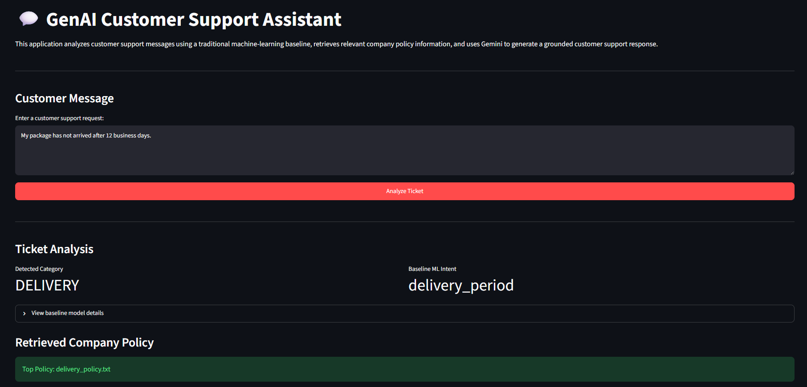
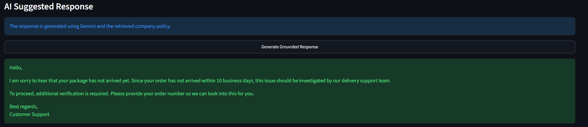

# GenAI-Powered Customer Support Assistant with RAG

A Generative AI customer support application developed as part of a Data Science Internship task.

The system analyzes customer support messages, predicts customer intent using a traditional machine-learning baseline, retrieves relevant company policy information, and uses Google's Gemini LLM to generate a grounded customer support response.

---

## Project Overview

Customer support teams receive large numbers of repetitive requests related to payments, refunds, deliveries, account access, and order cancellations.

This project explores how Generative AI and Retrieval-Augmented Generation (RAG) can assist customer support teams by:

- Analyzing customer support messages
- Predicting customer intent
- Identifying the relevant business category
- Retrieving relevant company policy information
- Generating grounded customer support responses
- Reducing unsupported or hallucinated company-specific information

The application combines traditional machine learning, information retrieval, and Generative AI in a simple end-to-end prototype.

---

## Business Use Case

The selected business use case is **Customer Support Automation**.

Example customer message:

> I was charged twice for my order.

The system can:

1. Analyze the customer message
2. Predict the customer intent using a baseline ML model
3. Detect the relevant support category
4. Retrieve the relevant company policy
5. Provide the retrieved policy as context to Gemini
6. Generate a professional customer support response

---

## System Architecture

```text
Customer Message
      |
      v
+---------------------------+
| Baseline ML Classifier    |
| TF-IDF + Logistic         |
| Regression                |
+---------------------------+
      |
      | Intent Prediction
      v

Customer Message
      |
      v
+---------------------------+
| Hybrid Policy Retriever   |
| Keyword Routing + TF-IDF  |
| Cosine Similarity         |
+---------------------------+
      |
      | Relevant Policy
      v
+---------------------------+
| Knowledge Base            |
| Refund / Payment /        |
| Delivery / Account /      |
| Cancellation Policies     |
+---------------------------+
      |
      | Retrieved Context
      v
+---------------------------+
| Gemini LLM                |
+---------------------------+
      |
      v
Grounded Customer
Support Response
```

---

## Dataset

The project uses the **Bitext Customer Support LLM Chatbot Training Dataset**.

The dataset contains customer support examples with fields such as:

- `instruction` — customer message
- `category` — high-level support category
- `intent` — detailed customer intent
- `response` — reference customer support response
- `flags` — language/style metadata

The dataset contains more than 26,000 customer support examples.

### Processed Features

Additional fields were created during preprocessing:

- `ticket_id`
- `instruction_clean`
- `instruction_word_count`
- `instruction_char_count`
- `response_word_count`
- `split`

---

## Data Preparation

The preprocessing pipeline includes:

- Missing-value validation
- Empty-text validation
- Exact duplicate checking
- Repeated-message analysis
- Label consistency checking
- Minimal text normalization
- Feature generation
- Train/validation/test splitting

The original customer text was preserved to avoid removing information that may be useful to an LLM.

---

## Data Splitting and Leakage Prevention

The dataset was divided approximately into:

- **70% Training**
- **15% Validation**
- **15% Testing**

The split was performed using unique customer messages rather than simply splitting individual rows.

This prevents the same customer message from appearing in both training and evaluation datasets.

The following overlap checks were performed:

```text
Train ∩ Validation = 0
Train ∩ Test       = 0
Validation ∩ Test  = 0
```

This provides a stronger and more reliable evaluation setup.

---

## Exploratory Data Analysis

EDA was performed to understand:

- Category distribution
- Intent distribution
- Category-to-intent relationships
- Customer message lengths
- Reference response lengths
- Duplicate customer messages
- Label consistency
- Class distribution

The EDA is available in:

```text
notebooks/01_data_exploration.ipynb
```

---

## Baseline Machine Learning Model

A traditional machine-learning baseline was developed before implementing the Generative AI solution.

### Pipeline

```text
Customer Message
      |
      v
TF-IDF Vectorization
      |
      v
Logistic Regression
      |
      v
Predicted Intent
```

The baseline allows the project to compare a conventional NLP approach with the GenAI/RAG solution.

### Evaluation Metrics

The baseline evaluation includes:

- Accuracy
- Precision
- Recall
- Macro F1-score
- Classification report
- Confusion matrix
- Error analysis

The experiment is available in:

```text
notebooks/03_baseline_evaluation.ipynb
```

The trained model is stored in:

```text
models/tfidf_logistic_regression_intent.joblib
```

---

## Generative AI Integration

Google Gemini is used as the Generative AI model.

The Gemini API receives a customer support request and generates a professional support response.

The prompt includes instructions to:

- Maintain a professional and empathetic tone
- Avoid inventing company policies
- Avoid making unsupported promises
- Request required customer information when necessary
- Avoid requesting sensitive credentials

The initial Gemini prototype is available in:

```text
notebooks/04_llm_prototype.ipynb
```

---

## Retrieval-Augmented Generation

A small RAG system was implemented to ground Gemini responses in company-specific information.

### Knowledge Base

The prototype contains synthetic company policy documents:

```text
knowledge_base/
├── account_policy.txt
├── cancellation_policy.txt
├── delivery_policy.txt
├── payment_policy.txt
└── refund_policy.txt
```

These policies were created specifically for the prototype and do not represent policies from the Bitext dataset.

### Retrieval Process

```text
Company Policies
      |
      v
Document Loading
      |
      v
Paragraph Chunking
      |
      v
TF-IDF Representation
      |
      v
Customer Query
      |
      v
Keyword Routing
      +
TF-IDF Cosine Similarity
      |
      v
Top Relevant Policy Chunks
```

The retrieved information is provided to Gemini as context before generating a response.

This helps reduce unsupported company-specific statements.

---

## Why RAG?

A normal LLM may not know an organization's actual policies.

For example:

```text
Customer:
How long does a refund take?
```

Without company context, an LLM may generate a plausible but unsupported answer.

With RAG:

```text
Customer Question
      |
      v
Retrieve Refund Policy
      |
      v
Relevant Policy Context
      +
Customer Question
      |
      v
Gemini
      |
      v
Grounded Response
```

This allows the response to use information contained in the project's knowledge base.

---

## Retrieval Evaluation

A small controlled retrieval test was created using policy-related customer questions.

The evaluation checks whether the retriever identifies the expected policy document for questions relating to:

- Refunds
- Payments
- Deliveries
- Cancellations
- Account support

Results are stored in:

```text
evaluation/rag_retrieval_results.csv
```

This is a small prototype evaluation and should not be interpreted as a comprehensive production benchmark.

---

## Streamlit Application

A Streamlit web interface was created to demonstrate the complete system.

Run the application with:

```bash
python -m streamlit run app.py
```

The application provides:

- Customer-message input
- Detected business category
- Baseline ML intent prediction
- Retrieved company policy
- Retrieval similarity information
- Additional retrieved context
- Gemini-generated grounded support response

---

## Application Example

### Customer Message

```text
I was charged twice for my order.
```

### System Output

```text
Detected Category:
PAYMENT

Retrieved Policy:
payment_policy.txt
```

The payment policy is then provided to Gemini so it can generate a response grounded in the available company information.

---

## Screenshots

### Ticket Analysis



### RAG-Generated Response



---

## Project Structure

```text
GenAI-Powered-Customer-Support-Assistant-with-RAG/
│
├── app.py
├── README.md
├── requirements.txt
├── .gitignore
├── .env.example
│
├── data/
│   ├── raw/
│   │   └── bitext_customer_support.csv
│   │
│   └── processed/
│       └── cleaned_support_tickets.csv
│
├── knowledge_base/
│   ├── account_policy.txt
│   ├── cancellation_policy.txt
│   ├── delivery_policy.txt
│   ├── payment_policy.txt
│   └── refund_policy.txt
│
├── notebooks/
│   ├── 01_data_exploration.ipynb
│   ├── 02_data_preprocessing.ipynb
│   ├── 03_baseline_evaluation.ipynb
│   ├── 04_llm_prototype.ipynb
│   └── 05_rag_prototype.ipynb
│
├── src/
│   ├── __init__.py
│   ├── config.py
│   ├── prompts.py
│   ├── llm.py
│   └── rag.py
│
├── models/
│   └── tfidf_logistic_regression_intent.joblib
│
├── evaluation/
│   ├── baseline_metrics.csv
│   ├── baseline_test_results.csv
│   └── rag_retrieval_results.csv
│
├── screenshots/
│   ├── app_ticket_analysis.png
│   └── app_rag_response.png
│
└── report/
```

---

## Technologies Used

- Python
- Pandas
- NumPy
- Scikit-learn
- TF-IDF
- Logistic Regression
- Cosine Similarity
- Google Gemini API
- Google GenAI SDK
- Streamlit
- Jupyter Notebook
- Pydantic
- Git / GitHub

---

## Installation

### 1. Clone the repository

```bash
git clone YOUR_REPOSITORY_URL
```

Move into the project directory:

```bash
cd GenAI-Powered-Customer-Support-Assistant-with-RAG
```

### 2. Create a virtual environment

```bash
python -m venv .venv
```

### 3. Activate the environment

Windows:

```bash
.venv\Scripts\activate
```

### 4. Install dependencies

```bash
pip install -r requirements.txt
```

### 5. Configure Gemini

Create a `.env` file in the project root:

```text
GEMINI_API_KEY=your_api_key_here
GEMINI_MODEL=gemini-3.5-flash-lite
```

The real `.env` file must not be committed to GitHub.

### 6. Run the application

```bash
python -m streamlit run app.py
```

---

## Security

API credentials are stored using environment variables.

The `.env` file is excluded from Git using `.gitignore`.

The repository contains only:

```text
.env.example
```

with placeholder values.

The application also instructs the LLM not to request sensitive information such as:

- Passwords
- Full card numbers
- Security codes

---

## Limitations

This project is a prototype and has several limitations.

### 1. Synthetic Knowledge Base

The company policies used for RAG were manually created for demonstration purposes and do not represent a real organization's production policies.

### 2. Limited Knowledge Base

Only five policy areas are included:

- Payments
- Refunds
- Deliveries
- Cancellations
- Account support

A real customer-support system would require a much larger and regularly maintained knowledge base.

### 3. Baseline Classification Errors

The TF-IDF + Logistic Regression baseline can misclassify customer messages, particularly when different intents contain similar vocabulary.

The baseline is included primarily for comparison and evaluation.

### 4. Simple Retrieval

The current prototype uses keyword routing combined with TF-IDF cosine similarity.

More advanced RAG systems could use semantic embedding models and vector databases.

### 5. LLM Hallucination Risk

RAG reduces unsupported answers but does not completely eliminate hallucination.

Important responses should still be reviewed when used in high-impact customer-service situations.

### 6. Free-Tier API Limitations

Gemini free-tier usage can have rate limits and variable response latency.

### 7. Small RAG Evaluation

The retrieval test uses a small controlled set and is not sufficient to establish production-level retrieval quality.

---

## Future Improvements

Future versions could include:

- Larger real-world customer-support datasets
- Larger company knowledge bases
- Semantic embeddings
- FAISS or Chroma vector databases
- Improved document chunking
- Chunk overlap
- Top-k optimization
- Hybrid semantic and lexical retrieval
- Reranking
- Better intent classification models
- Automated RAG evaluation
- Response-quality evaluation
- Human feedback
- Conversation history
- Customer-support agent escalation
- Cloud deployment
- Authentication and access control
- Monitoring and logging

---

## Key Learning Outcomes

This project demonstrates an end-to-end workflow involving:

```text
Data Collection
      ↓
EDA
      ↓
Data Preprocessing
      ↓
Leakage-Safe Evaluation
      ↓
Traditional NLP Baseline
      ↓
Generative AI
      ↓
Information Retrieval
      ↓
Retrieval-Augmented Generation
      ↓
Web Application
```

It also demonstrates the difference between:

```text
Traditional NLP
TF-IDF → Classifier
```

and:

```text
Generative AI + RAG
Question → Retrieval → Context → LLM → Grounded Response
```

---

## Conclusion

This project demonstrates a practical Generative AI application for customer support.

By combining traditional machine learning, information retrieval, Gemini, and Retrieval-Augmented Generation, the prototype can analyze customer requests, retrieve relevant business information, and generate context-aware customer support responses.

The project also highlights important limitations of LLM-based systems, including hallucination risk, retrieval quality, data privacy, latency, and the need for human oversight in production environments.

---